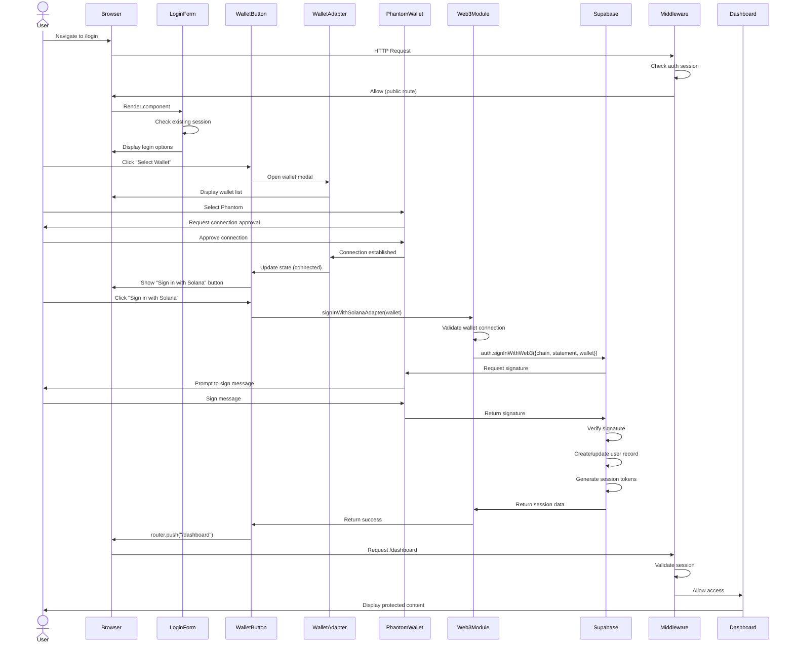
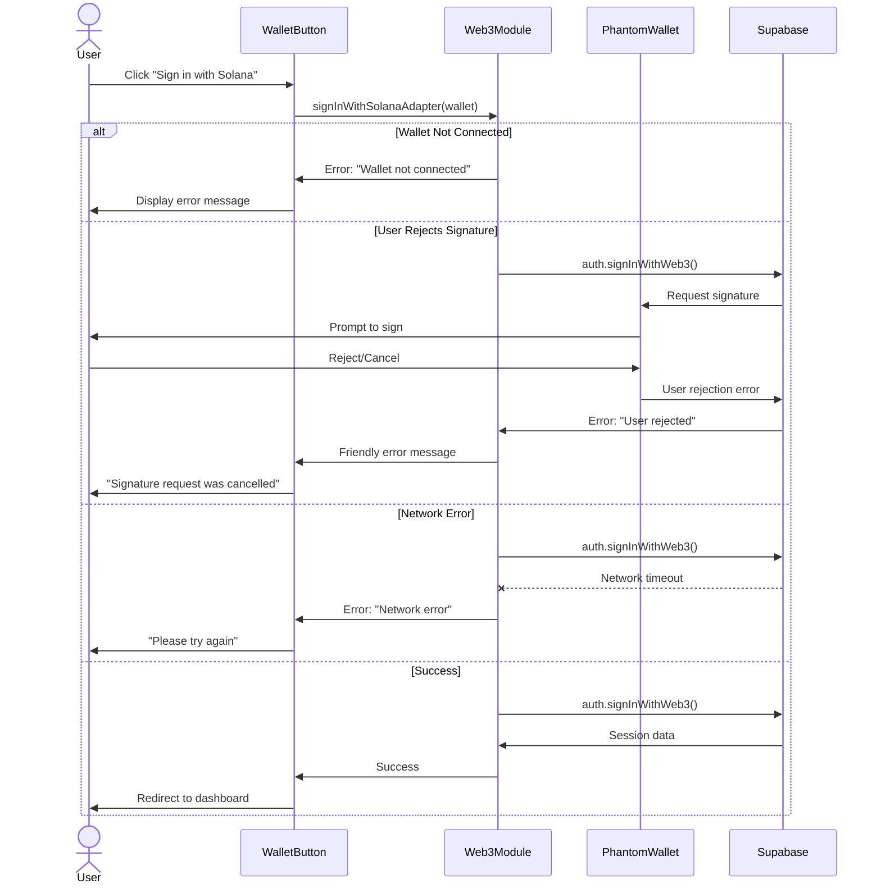
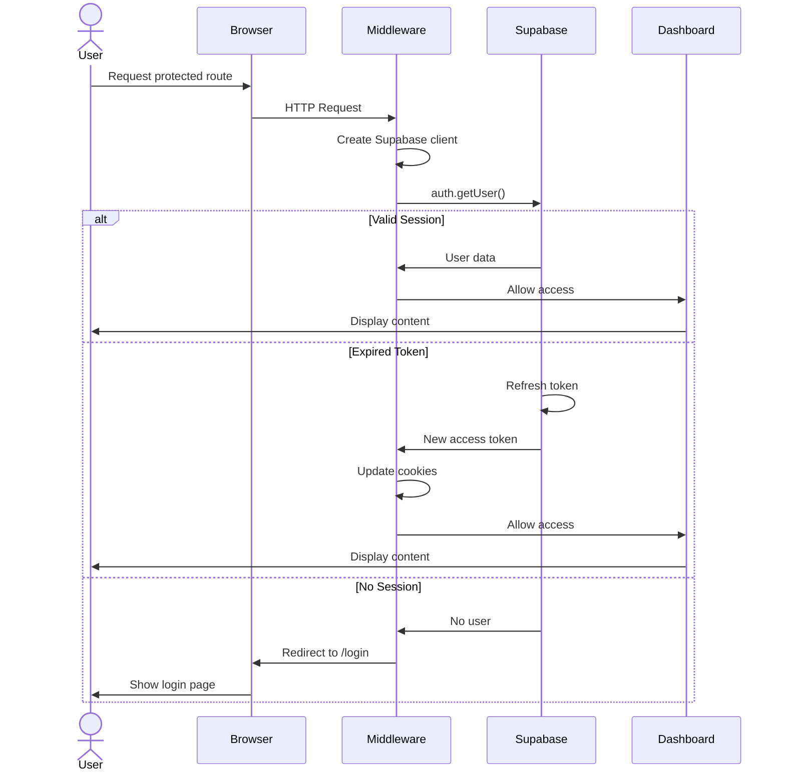
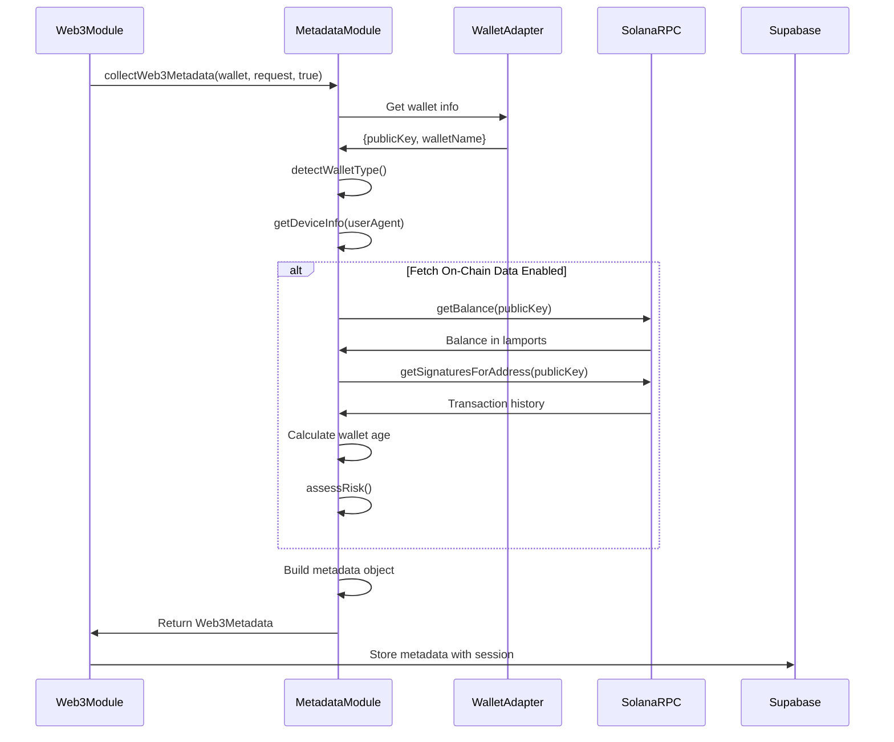

# Web3 Authentication Flow Diagrams

## 🔄 Detailed Sequence Diagrams

### **1. Complete Authentication Flow**



---

### **2. Error Handling Flow**



---

### **3. Session Management Flow**



---

### **4. Metadata Collection Flow**



---

## 🎯 State Transition Diagrams

### **Wallet Button States**

```
┌─────────────────┐
│   NOT MOUNTED   │
│  (Loading...)   │
└────────┬────────┘
         │
         │ Component mounts
         ▼
┌─────────────────┐
│ NOT CONNECTED   │
│ WalletMultiBtn  │
└────────┬────────┘
         │
         │ User selects wallet
         │ & approves connection
         ▼
┌─────────────────┐
│   CONNECTED     │
│ "Sign in with   │
│    Solana"      │
└────────┬────────┘
         │
         │ User clicks sign in
         ▼
┌─────────────────┐
│    LOADING      │
│  "Signing in"   │
│   (Spinner)     │
└────────┬────────┘
         │
         ├─ Success ──────────┐
         │                    ▼
         │              ┌──────────┐
         │              │REDIRECTING│
         │              │    to     │
         │              │ Dashboard │
         │              └──────────┘
         │
         └─ Error ───────────┐
                             ▼
                    ┌─────────────────┐
                    │ ERROR DISPLAYED │
                    │  (Stay on page) │
                    └────────┬────────┘
                             │
                             │ User retries
                             ▼
                    ┌─────────────────┐
                    │   CONNECTED     │
                    │ (Ready to retry)│
                    └─────────────────┘
```

---

### **Authentication State Machine**

```
┌──────────────┐
│ UNAUTHENTICATED │
└───────┬────────┘
        │
        ├─ Email/OTP Flow ────┐
        │                     ▼
        │            ┌──────────────┐
        │            │ OTP SENT     │
        │            │ (Verify code)│
        │            └──────┬───────┘
        │                   │
        │                   │ Code verified
        │                   ▼
        │            ┌──────────────┐
        │            │ AUTHENTICATED│
        │            └──────────────┘
        │
        └─ Web3 Flow ────────┐
                             ▼
                    ┌──────────────────┐
                    │ WALLET CONNECTING│
                    └────────┬─────────┘
                             │
                             │ Connected
                             ▼
                    ┌──────────────────┐
                    │ SIGNING MESSAGE  │
                    └────────┬─────────┘
                             │
                             │ Signed
                             ▼
                    ┌──────────────────┐
                    │  AUTHENTICATED   │
                    └──────────────────┘
```

---

## 🔐 Security Flow

### **Cryptographic Signature Verification**

```
┌──────────────────────────────────────────────────────────┐
│                    CLIENT SIDE                           │
├──────────────────────────────────────────────────────────┤
│                                                          │
│  1. User initiates sign-in                              │
│     ↓                                                    │
│  2. App requests signature from wallet                  │
│     ↓                                                    │
│  3. Wallet generates message:                           │
│     "I accept the SSI Automations Terms of Service..."  │
│     + Nonce (timestamp)                                 │
│     + Domain                                            │
│     ↓                                                    │
│  4. User approves signature request                     │
│     ↓                                                    │
│  5. Wallet signs message with private key               │
│     (Private key NEVER leaves wallet)                   │
│     ↓                                                    │
│  6. Signature + Public Key sent to Supabase             │
│                                                          │
└──────────────────────────────────────────────────────────┘
                         │
                         │ HTTPS
                         ▼
┌──────────────────────────────────────────────────────────┐
│                    SERVER SIDE                           │
├──────────────────────────────────────────────────────────┤
│                                                          │
│  7. Supabase receives:                                  │
│     - Message                                           │
│     - Signature                                         │
│     - Public Key                                        │
│     ↓                                                    │
│  8. Verify signature using public key                   │
│     (Cryptographic proof of ownership)                  │
│     ↓                                                    │
│  9. Check nonce to prevent replay attacks               │
│     ↓                                                    │
│ 10. Verify domain matches                               │
│     ↓                                                    │
│ 11. Create/retrieve user by wallet address              │
│     ↓                                                    │
│ 12. Generate session tokens                             │
│     - Access token (short-lived)                        │
│     - Refresh token (long-lived)                        │
│     ↓                                                    │
│ 13. Return session to client                            │
│                                                          │
└──────────────────────────────────────────────────────────┘
```

---

## 📊 Data Flow Diagram

```
┌─────────────┐
│   Browser   │
│   Storage   │
│  (Cookies)  │
└──────┬──────┘
       │
       │ Session Tokens
       │
       ▼
┌─────────────────────────────────────┐
│      Supabase Client (Browser)      │
│  - Manages auth state               │
│  - Handles token refresh            │
│  - Provides auth context            │
└──────┬──────────────────────────────┘
       │
       │ API Calls
       │
       ▼
┌─────────────────────────────────────┐
│      Supabase Auth Service          │
│  - Validates tokens                 │
│  - Refreshes expired tokens         │
│  - Manages user sessions            │
└──────┬──────────────────────────────┘
       │
       │ Database Queries
       │
       ▼
┌─────────────────────────────────────┐
│      PostgreSQL Database            │
│  ┌─────────────────────────────┐   │
│  │ auth.users                  │   │
│  │ - id (UUID)                 │   │
│  │ - wallet_address (unique)   │   │
│  │ - created_at                │   │
│  │ - last_sign_in_at           │   │
│  └─────────────────────────────┘   │
│                                     │
│  ┌─────────────────────────────┐   │
│  │ auth.sessions               │   │
│  │ - id (UUID)                 │   │
│  │ - user_id (FK)              │   │
│  │ - access_token              │   │
│  │ - refresh_token             │   │
│  │ - expires_at                │   │
│  └─────────────────────────────┘   │
│                                     │
│  ┌─────────────────────────────┐   │
│  │ public.user_metadata        │   │
│  │ - user_id (FK)              │   │
│  │ - wallet_type               │   │
│  │ - device_type               │   │
│  │ - risk_score                │   │
│  │ - sol_balance               │   │
│  │ - wallet_age_days           │   │
│  └─────────────────────────────┘   │
└─────────────────────────────────────┘
```

---

## 🔄 Token Refresh Mechanism

```
┌────────────────────────────────────────────────────────┐
│              TOKEN LIFECYCLE                           │
├────────────────────────────────────────────────────────┤
│                                                        │
│  User Signs In                                         │
│       ↓                                                │
│  ┌──────────────────────────────────────┐            │
│  │ Access Token (1 hour)                │            │
│  │ Refresh Token (30 days)              │            │
│  └──────────────────────────────────────┘            │
│       ↓                                                │
│  Tokens stored in HTTP-only cookies                   │
│       ↓                                                │
│  User makes requests (45 minutes pass)                │
│       ↓                                                │
│  ┌──────────────────────────────────────┐            │
│  │ Access Token: Still valid            │            │
│  │ Requests succeed                     │            │
│  └──────────────────────────────────────┘            │
│       ↓                                                │
│  User makes request (65 minutes pass)                 │
│       ↓                                                │
│  ┌──────────────────────────────────────┐            │
│  │ Access Token: EXPIRED                │            │
│  │ Middleware detects expiration        │            │
│  └──────────────────────────────────────┘            │
│       ↓                                                │
│  Middleware calls auth.getUser()                      │
│       ↓                                                │
│  ┌──────────────────────────────────────┐            │
│  │ Supabase checks refresh token        │            │
│  │ Refresh token: VALID                 │            │
│  │ Generate new access token            │            │
│  └──────────────────────────────────────┘            │
│       ↓                                                │
│  New access token set in cookies                      │
│       ↓                                                │
│  Request continues with new token                     │
│       ↓                                                │
│  User experience: SEAMLESS (no re-login)              │
│                                                        │
└────────────────────────────────────────────────────────┘
```

---

## 🎭 User Journey Map

```
┌─────────────────────────────────────────────────────────────┐
│                    FIRST-TIME USER                          │
├─────────────────────────────────────────────────────────────┤
│                                                             │
│  1. Discovers SSI Automations                              │
│     Emotion: 😊 Curious                                     │
│     ↓                                                       │
│  2. Clicks "Get Started" → Lands on /login                 │
│     Emotion: 🤔 Evaluating options                          │
│     ↓                                                       │
│  3. Sees "Select Wallet" button                            │
│     Emotion: 😃 Excited (has Phantom wallet)                │
│     ↓                                                       │
│  4. Clicks button → Wallet modal appears                   │
│     Emotion: 😌 Familiar interface                          │
│     ↓                                                       │
│  5. Selects Phantom → Approves connection                  │
│     Emotion: 🔒 Feels secure (knows this flow)              │
│     ↓                                                       │
│  6. Clicks "Sign in with Solana"                           │
│     Emotion: ⚡ Fast and easy                               │
│     ↓                                                       │
│  7. Signs message in wallet                                │
│     Emotion: ✅ Confident (no password needed)              │
│     ↓                                                       │
│  8. Redirected to dashboard                                │
│     Emotion: 🎉 Delighted (instant access)                  │
│                                                             │
└─────────────────────────────────────────────────────────────┘

┌─────────────────────────────────────────────────────────────┐
│                   RETURNING USER                            │
├─────────────────────────────────────────────────────────────┤
│                                                             │
│  1. Visits SSI Automations                                 │
│     Emotion: 😊 Familiar                                    │
│     ↓                                                       │
│  2. Middleware checks session                              │
│     Session: VALID                                         │
│     ↓                                                       │
│  3. Auto-redirected to dashboard                           │
│     Emotion: 🚀 Seamless (no login needed)                  │
│     ↓                                                       │
│  4. Continues work                                         │
│     Emotion: 💯 Productive                                  │
│                                                             │
└─────────────────────────────────────────────────────────────┘
```

---

**Document Version**: 1.0  
**Last Updated**: 2025-01-15  
**Companion to**: WEB3_AUTH_SYSTEM_DOCUMENTATION.md
